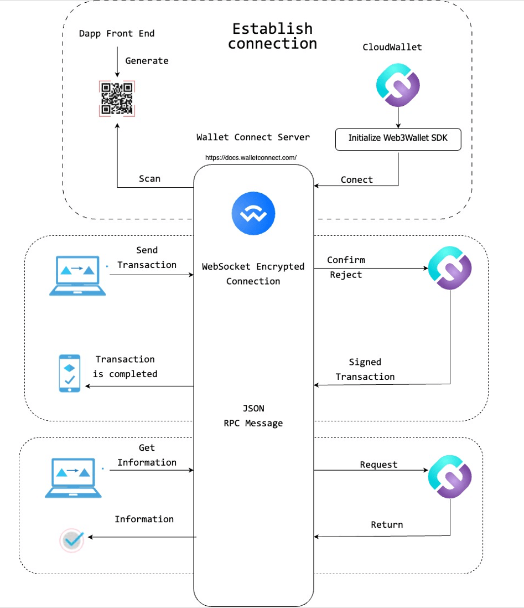

# WAX JSON Websocket API (As Used with WalletConnect)

1. Overview




2. Login session

Utilize a socket-based login session to establish a connection between a decentralized application (Dapp) and WalletConnect.


### Parameters


<table>
  <tr>
   <td>requiredNamespaces
   </td>
   <td>{ \
        chains?: string[];
<p>
        methods: string[];
<p>
        events: string[];
<p>
 \
}
   </td>
   <td>chain: list chain id support(Currently, only support one wax chain)
<p>
Method: list support method
<p>
Events: list support events
   </td>
  </tr>
  <tr>
   <td>pairingTopic
   </td>
   <td>string
   </td>
   <td>Pairing topic id
   </td>
  </tr>
</table>


Example:


```
requiredNamespaces: {
  wax: {
    methods: [
      "wax_sign_transaction",
      "wax_sign_message",
      "wax_push_transaction",
      "wax_sign_push_transaction",
      "wax_sign_pushed_transaction",
      "wax_request_account",
      "wax_get_available_keys",
      "wax_get_required_keys"
    ],
      chains: [
        "antelope:1064487b3cd1a897ce03ae5b6a865651"
      ],
        events: []
  }
},
pairingTopic: '4738621948defd3bf860cd2a235f1d998ed7e136fd3c82f19f3cd6ce7f8abcc8'


```


### Return

If the request is rejected, a 4001 error will be returned.

Example:


```
{
    "message": "User rejected methods.",
    "code": 5002
}
```


If the request is accepted, a WAX account string is returned.


### Example


```
{
  topic: "6907a4234c1f1cd21e668514997995c614bfe5c5cf7b87b4840e0135b77205aa",
  relay: {
    protocol: "irn"
  },
  expiry: 1692803184,
  namespaces: {
    wax: {
      accounts: [
        "antelope:1064487b3cd1a897ce03ae5b6a865651:qs.wam@active"
      ],
      methods: [
        "wax_sign_transaction",
        "wax_sign_message",
        "wax_push_transaction",
        "wax_sign_push_transaction",
        "wax_sign_pushed_transaction",
        "wax_request_account",
        "wax_get_available_keys",
        "wax_get_required_keys"
      ],
      events: []
    }
  },
  acknowledged: true,
  pairingTopic: "829b57ad756e90851f73880abec4495b1ae76ba25e4f1dd72dfd802d25088b66",
  requiredNamespaces: {
    wax: {
      methods: [
        "wax_sign_transaction",
        "wax_sign_message",
        "wax_push_transaction",
        "wax_sign_push_transaction",
        "wax_sign_pushed_transaction",
        "wax_request_account",
        "wax_get_available_keys",
        "wax_get_required_keys"
      ],
      chains: [
        "antelope:1064487b3cd1a897ce03ae5b6a865651"
      ],
      events: []
    }
  },
  optionalNamespaces: {},
  controller: "eb288c78fa542b94163d511d8742ae46ce2809d7512aa58b50965cea95fbe643",
  self: {
    publicKey: "18a1f6da1dfa6f4147c017d22a62ea86232ed90c3742324ae29cc8270b756373",
    metadata: {
      description: "React App for WalletConnect",
      url: "http://localhost:3000",
      icons: [
        "https://avatars.githubusercontent.com/u/37784886"
      ],
      name: "React App"
    }
  },
  peer: {
    publicKey: "eb288c78fa542b94163d511d8742ae46ce2809d7512aa58b50965cea95fbe643",
    metadata: {
      name: "Cloud Wallet",
      description: "Cloud Wallet is your all-inclusive custody wallet to access WAX blockchain and other web3 application. Trusted by more than 13 millions of users worldwide.",
      url: "https://www.mycloudwallet.com/",
      icons: [
        "https://www.mycloudwallet.com/logo192.png"
      ]
    }
  }
}

```


3. RPC specs

**Note**: To provide context and information about the requesting DApp, Wallet can retrieve that data from the login session.


<table>
  <tr>
   <td>name
   </td>
   <td>string
   </td>
   <td>Name of Dapp
   </td>
  </tr>
  <tr>
   <td>description
   </td>
   <td>string
   </td>
   <td>Description of Dapp
   </td>
  </tr>
  <tr>
   <td>icons
   </td>
   <td>string[]
   </td>
   <td>Array url of icon
   </td>
  </tr>
  <tr>
   <td>url
   </td>
   <td>string
   </td>
   <td>Url of Dapp
   </td>
  </tr>
  <tr>
   <td>chains
   </td>
   <td>string[]
   </td>
   <td>Array of the requested login chainIds
   </td>
  </tr>
</table>


Example:


<table>
  <tr>
   <td>{
<p>
  name: "Atomic Assets",
<p>
  description: "NFT Marketplace on WAX",
<p>
  url: "https://atomicassets.io",
<p>
  icons: [
<p>
    "https://avatars.githubusercontent.com/u/37784886"
<p>
  ],
<p>
 chains: [
<p>
        "antelope:1064487b3cd1a897ce03ae5b6a865651"
<p>
      ]
<p>
}
   </td>
  </tr>
  <tr>
   <td>
   </td>
  </tr>
</table>


## wax_get_available_keys

Get public keys associated with the account, corresponding to the private keys held by the wallet.

Platforms: Desktop, Mobile


### Parameters


<table>
  <tr>
   <td>account
   </td>
   <td>string
   </td>
   <td>Account and permission
   </td>
  </tr>
</table>


### Return


<table>
  <tr>
   <td>public_keys
   </td>
   <td>Array of strings (PublicKey)
   </td>
   <td>Public keys associated with the private keys that the wallet holds
   </td>
  </tr>
</table>


### Example


```
// Request
{
   acount:"mywaxaccount@active",
}

// Result
{
   "public_keys":[
      "EOS7y2xNA5TsoAXTeGJgfDMhVGPMCxJ9vuM71H9TSe48CoECKsXej",
      "EOS8UhZSLGoiUSifugc4x2LrLbKW6GwKKNzJbxtZBBChqcKbfV18G"
   ]
}
```


## wax_sign_transaction

Sign a transaction with the private keys specified via their public keys.

Refer [this](https://github.com/EOSIO/eosjs/blob/master/src/eosjs-jssig.ts#L63) to implement the sign transaction

(Currently, WCW is only support sign with active permission)

Platforms: Desktop, Mobile


### Parameters: application/json


<table>
  <tr>
   <td>required_keys
   </td>
   <td>Array of strings (PublicKey)
   </td>
   <td>Public keys associated with the private keys needed to sign the transaction
   </td>
  </tr>
  <tr>
   <td>serialized_transaction
   </td>
   <td>Array of Uint8
   </td>
   <td>Transaction to sign
   </td>
  </tr>
  <tr>
   <td>serialized_context_free_data(optional)
   </td>
   <td>Array of Uint8
   </td>
   <td>Context-free data to sign
   </td>
  </tr>
  <tr>
   <td>transaction (optional)
   </td>
   <td>Object(Transaction)
<p>
{  \
expiration?: string; ref_block_num?: number; ref_block_prefix?: number; max_net_usage_words?: number; max_cpu_usage_ms?: number; delay_sec?: number; context_free_actions?: Action[]; context_free_data?: Uint8Array[]; actions: Action[]; transaction_extensions?: [number, string][]; resource_payer?: ResourcePayer;  \
}
   </td>
   <td>
   </td>
  </tr>
</table>


### Return: application/json


<table>
  <tr>
   <td>signatures
   </td>
   <td>Array of strings (Signature)
   </td>
   <td>array of signatures required to authorize transaction
   </td>
  </tr>
  <tr>
   <td>serialized_transaction
   </td>
   <td>Array of Uint8
   </td>
   <td>Transaction to sign
   </td>
  </tr>
  <tr>
   <td>serialized_context_free_data(optional)
   </td>
   <td>Array of Uint8
   </td>
   <td>Context-free data to sign
   </td>
  </tr>
</table>


### Example:


```
// Request
{
  required_keys: [
    "EOS5wMVefW4H11BbhQ7uqtojfrFG9tsXkXuiTNkBvzFhCbysQjjkp",
    "EOS6wigZhV8BEEdFLebPiiNGNKyPw8X3RqxLvDaoYAP7z4SkLKbYi"
  ],
  serialized_transaction: {
      1,
      2,
      3,
      4
  },
  transaction: {
    delay_sec: 0,
    max_cpu_usage_ms: 0,
    actions: [
      {
        account: "eosio.token",
        name: "transfer",
        data: {
          from: "qs.wam",
          to: "ac.wam",
          quantity: "0.12300001 WAX",
          memo: ""
        },
        authorization: [
          {
            actor: "qs.wam",
            permission: "active"
          }
        ]
      },
      {
        account: "eosio.token",
        name: "transfer",
        data: {
          from: "qs.wam",
          to: "ac.wam",
          quantity: "0.00000001 WAX",
          memo: ""
        },
        authorization: [
          {
            actor: "qs.wam",
            permission: "active"
          }
        ]
      }
    ]
  }
}


// Result
{
   "signatures":[
      "SIG_K1_abcdef..."
   ],
   "serialized_transaction":[
      1,
      2,
      3,
      4
   ],
   "serialized_context_free_data":[
      5,
      6,
      7,
      8
   ]
}

```


## wax_sign_message

Sign a message with the private keys specified via their public keys.

(Currently, WCW is only support sign with active permission)

Platforms: Desktop, Mobile


### Parameters


<table>
  <tr>
   <td>message
   </td>
   <td>any[]
   </td>
   <td>Array of message need to sign
   </td>
  </tr>
  <tr>
   <td>required_keys
   </td>
   <td>Array of strings (PublicKey)
   </td>
   <td>the public key of the corresponding private key to sign the transaction with
   </td>
  </tr>
</table>


### Return: application/json


<table>
  <tr>
   <td>signature
   </td>
   <td>Array of strings (PublicKey) (Signature)
   </td>
   <td>
   </td>
  </tr>
</table>


### Example


```
// Request
{
{
    message: [
      {
        account: "eosio.token",
        name: "transfer",
        data: {
          from: account,
          to: "ac.wam",
          quantity: "0.12300001 WAX",
          memo: "",
        },
        authorization: [
          {
            actor: account,
            permission: "active",
          },
        ],
      }
    ];
    required_keys: [
        "EOS5wMVefW4H11BbhQ7uqtojfrFG9tsXkXuiTNkBvzFhCbysQjjkp",
        "EOS6wigZhV8BEEdFLebPiiNGNKyPw8X3RqxLvDaoYAP7z4SkLKbYi"
    ]
}

}

// Result
{
   "signature":"SIG_K1_KAeg7fP2fQzMSQKg8XdTAd2rDFEkJosq1KeTtvB8shzbn532F5UPWy62io2Wpud3Zj3XXuckcmYNV5qPR8tqAkns7m83WK"
```


## wax_get_required_keys(optional)

Platforms: Desktop, Mobile

Refer: [https://developers.eos.io/manuals/eos/v2.2/nodeos/plugins/chain_api_plugin/api-reference/index#operation/get_required_keys](https://developers.eos.io/manuals/eos/v2.2/nodeos/plugins/chain_api_plugin/api-reference/index#operation/get_required_keys)

Returns the required keys needed to sign a transaction.


### Parameters


<table>
  <tr>
   <td>transaction
   </td>
   <td>object(Transaction) \
{
<p>
      "expiration":"string",
<p>
      "ref_block_num":0,
<p>
      "ref_block_prefix":0,
<p>
      "max_net_usage_words":"string",
<p>
      "max_cpu_usage_ms":"string",
<p>
      "delay_sec":0,
<p>
      "context_free_actions":[
<p>

<p>
      ],
<p>
      "actions":[
<p>

<p>
      ],
<p>
      "transaction_extensions":[
<p>

<p>
      ]
<p>
   }
<p>
}
   </td>
   <td>
   </td>
  </tr>
  <tr>
   <td>available_keys
   </td>
   <td>Array of strings (PublicKey)
   </td>
   <td>
   </td>
  </tr>
</table>


### Return


<table>
  <tr>
   <td>public_keys
   </td>
   <td>Array of strings (PublicKey)
   </td>
   <td>An array of public key strings associated with the private keys that are required to sign the transaction.
   </td>
  </tr>
</table>


### Example:


```
// Request
{
   "transaction":{
      "expiration":"string",
      "ref_block_num":0,
      "ref_block_prefix":0,
      "max_net_usage_words":"string",
      "max_cpu_usage_ms":"string",
      "delay_sec":0,
      "context_free_actions":[

      ],
      "actions":[

      ],
      "transaction_extensions":[

      ]
   },
   "available_keys":[
      "EOS7y2xNA5TsoAXTeGJgfDMhVGPMCxJ9vuM71H9TSe48CoECKsXej",
      "EOS8UhZSLGoiUSifugc4x2LrLbKW6GwKKNzJbxtZBBChqcKbfV18G"
   ]
}

// Result
{
   "public_keys":[
      "EOS7y2xNA5TsoAXTeGJgfDMhVGPMCxJ9vuM71H9TSe48CoECKsXej",
   ]
}
```


## wax_push_transaction(optional)

[https://developers.eos.io/manuals/eos/v2.1/nodeos/plugins/chain_api_plugin/api-reference/index/#operation/push_transactions](https://developers.eos.io/manuals/eos/v2.1/nodeos/plugins/chain_api_plugin/api-reference/index/#operation/push_transactions)

This method expects a transaction in JSON format and will attempt to apply it to the blockchain.

Platforms: Desktop, Mobile


### Parameters: application/json


<table>
  <tr>
   <td>signatures
   </td>
   <td>Array of strings (Signature)
   </td>
   <td>array of signatures required to authorize transaction
   </td>
  </tr>
  <tr>
   <td>compression
   </td>
   <td>boolean
   </td>
   <td>Compression used, usually false
   </td>
  </tr>
  <tr>
   <td>packed_context_free_data
   </td>
   <td>string
   </td>
   <td>json to hex
   </td>
  </tr>
  <tr>
   <td>packed_trx
   </td>
   <td>string
   </td>
   <td>Transaction object json to hex
   </td>
  </tr>
</table>


### Return: application/json


<table>
  <tr>
   <td>
   </td>
   <td>
   </td>
   <td>
   </td>
  </tr>
</table>


### Example:


```

```
